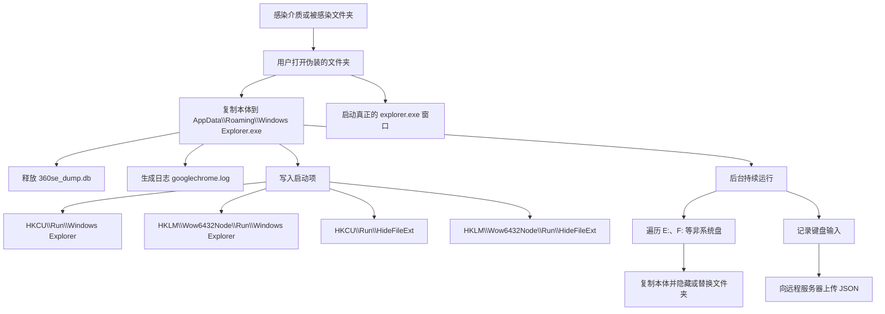

# Windows Explorer.exe 样本分析报告

> 本文档记录当前样本的静态信息、利用Procmon对其行为观察的结果、`googlechrome.log` 日志证据和两份微步云沙箱报告。结论以现有样本和测试环境为依据，不代表该家族的全部变种。

## 样本信息

| 项目 | 值 |
| --- | --- |
| 样本名称 | `Windows Explorer.exe` |
| 文件大小 | 9,376,256 字节（9156 KiB） |
| MD5 | `1d5d289446a9ef04bbf74fdc0f20183b` |
| CRC32 | `B3FF8F3E` |
| CRC64 | `73904EF92A013759` |
| SHA1 | `a158a36de522336a19fad5ccb4f599456c313566` |
| SHA256 | `e22902d3a4d944ca202670b373e6cdc2119b78e22a3217afea8ba8932e2451f2` |
| 头部 64 KiB MD5 | `134f9b0d2a51fd14e9ebdcbc56d63e11` |
| 编写语言 | Go（根据现有分析） |

## 安全须知

本样本仅供隔离环境中的分析与查杀测试。不要在真实办公环境、联网主机或含有重要数据的 U 盘上运行；分析完成后应删除样本及其释放文件，并检查其他盘符和备份介质。README 中的路径和日志来自测试环境，不能作为安全运行样本的建议。

## 行为概览



整体上，这是一个伪装成 Explorer 的文件夹传播型木马，同时具备持久化、键盘记录和数据外传行为。

## 感染与伪装流程

1. 被感染的 U 盘、移动硬盘或本地分区中出现伪装的可执行文件/文件夹。
2. 用户打开被感染的“文件夹”后，样本把自身复制到 `%USERPROFILE%\AppData\Roaming\Windows Explorer.exe`。
3. 样本在同一目录释放 `360se_dump.db`，并生成日志文件 `googlechrome.log`。
4. 样本写入启动项，然后启动真正的 `explorer.exe` 打开用户期望的目录。
5. 恶意本体留在后台，等待下一次启动、介质插入或文件夹访问。

## 启动项证据

利用各种分析手段得知，病毒启动后会写入如下注册表值

| 注册表位置 | 值名称 | 作用判断 |
| --- | --- | --- |
| `HKCU\Software\Microsoft\Windows\CurrentVersion\Run` | `Windows Explorer` | 当前用户登录后启动样本 |
| `HKLM\SOFTWARE\Wow6432Node\Microsoft\Windows\CurrentVersion\Run` | `Windows Explorer` | 32 位兼容视图下的计算机级启动项 |
| `HKCU\Software\Microsoft\Windows\CurrentVersion\Run` | `HideFileExt` | 当前用户登录后启动/控制隐藏扩展名相关逻辑 |
| `HKLM\SOFTWARE\Wow6432Node\Microsoft\Windows\CurrentVersion\Run` | `HideFileExt` | 微步 Win7 报告记录的计算机级启动项 |

样本还写入了 `Explorer\StartupApproved\Run` 下的对应状态项。这些记录用于控制启动项是否启用，属于启动持久化的辅助证据。

## 微步云沙箱证据

两份报告使用同一样本，在不同 Windows 环境中运行：

| 环境 | 执行时长 | 风险评分 | 主要观察 |
| --- | ---: | ---: | --- |
| Windows 10 1903 x64 / Office 2016 | 279 秒 | 5.8 | 复制本体、创建伴随文件、修改启动项和 Explorer 设置、键盘钩子 |
| Windows 7 SP1 x64 / Office 2013 | 198 秒 | 7.6 | 上述行为，并明确出现 `--daemon` 子进程、反沙箱延迟和反 Wine 检测 |

### 进程与落地文件

Win10 报告中的沙箱进程名为 `BIM.exe66666`，Win7 报告中的初始进程名为 `.exe.exe`。这些名称是报告环境中的执行名称，不应据此判断样本原始文件名。Win7 进一步记录了子进程：

```text
C:\Ewzyzqe\.exe.exe --daemon
```

两套系统都观察到样本将本体复制到：

```text
%USERPROFILE%\AppData\Roaming\Windows Explorer.exe
```

并创建或写入：

```text
%USERPROFILE%\AppData\Roaming\360se_dump.db
%USERPROFILE%\AppData\Roaming\googlechrome.log
```

Win7 报告还提取出 `360se_dump.db` 为 SQLite 3 数据库，并发现 `360se_dump.db-journal`。样本字符串和模块信息包含 `gorm.io/driver/sqlite`、`github.com/mattn/go-sqlite3`，说明该数据库是实际使用的数据存储，不只是无意义的占位文件。具体字段和数据用途仍需对数据库内容进行单独分析。

### 注册表修改与伪装

微步报告直接记录了以下设置被写入：

```text
HKCU\Software\Microsoft\Windows\CurrentVersion\Explorer\Advanced\Hidden
HKCU\Software\Microsoft\Windows\CurrentVersion\Explorer\Advanced\HideFileExt
HKLM\SOFTWARE\Wow6432Node\Microsoft\Windows\CurrentVersion\explorer\Advanced\Hidden
HKLM\SOFTWARE\Wow6432Node\Microsoft\Windows\CurrentVersion\explorer\Advanced\HideFileExt
```

这与隐藏文件、隐藏扩展名的行为相符，会增加用户识别伪装文件的难度。报告同时命中 `stealth_hiddenfile`、`stealth_hidden_extension` 和 MITRE ATT&CK `T1112 Modify Registry`。

### 键盘钩子

Win7 报告捕获到以下 API 调用：

```text
SetWindowsHookExW
hook_identifier: WH_KEYBOARD_LL
```

并命中 `infostealer_keylogger`、`message_hook` 和 `get_key_state`。这从 API 层面确认样本能够安装系统范围的低级键盘钩子；`googlechrome.log` 中的 `[Ctrl]v`、`[Windows]` 等记录与该行为相互印证。

### 环境感知与反分析

报告显示样本会查询系统信息、计算机名、时区和按键状态，并尝试检测 Wine 环境。Win7 报告还记录了约 420 秒的延迟行为，并命中 `antisandbox_sleep`。因此，在自动化沙箱中若没有出现某一行为，不能证明样本不具备该能力；它可能根据环境、交互状态或延迟策略改变执行路径。

微步云沙箱报告中在 Win7 环境中显示病毒曾尝试检测 Wine 环境，在 Win10 环境中并未报告。我在实际使用虚拟机进行分析之时，发现似乎只有 Win7 环境会检测虚拟机，市面上主流的虚拟机软件如 VMWare Workstation、VirtualBox、Hyper-V（我只测试了这三款）都不能在未伪装的 Win7 下正常运行它。使用 Win10 则可以。

但是同样搭载 Win7 的云办公环境（有一定证据表明其为 Ubuntu 下 qemu 虚拟的 Win7）就可以正常运行，或许病毒无法识别 qemu 的虚拟机为虚拟机？有待验证。

### 网络证据边界

两份微步报告的网络汇总虽没有捕获到完整 TCP/HTTP 会话（可能与沙箱路由、DNS 或样本执行路径有关），但本地 `googlechrome.log` 已经记录了对 `klserver.hakurei.cc` 的请求，以及返回 `{"msg":"succeed"}` 的成功上传。结合下方 `PML 与日志证据` 我认为有理由认为其有能力与远程服务器通信。

## 证据结论

现有三类材料形成相互印证的行为链：

```text
伪装文件启动
    -> 复制本体到 AppData\\Roaming
    -> 创建 SQLite 数据库和运行日志
    -> 写入多个 Run 启动项
    -> 修改 Hidden / HideFileExt
    -> 启动后台 daemon
    -> 安装 WH_KEYBOARD_LL 键盘钩子
    -> 记录按键并尝试上传
    -> 扫描其他分区并复制传播
```

其中，键盘记录、注册表持久化、Explorer 设置修改和本体落地均已被沙箱直接观察；跨盘符传播和成功网络上传则主要由 PML 与 `googlechrome.log` 提供现场证据。

## PML 与日志证据

### 扫盘和传播

我在虚拟机使用 Procmon 对其进行了检测，导出了日志 `Logfile.PML` 。它的捕获规模约为 116 万条事件，涉及大量文件系统、注册表和进程相关操作。分析发现软件会在后台持续不间断的扫盘以达到感染所有可感染文件的目的。与 `googlechrome.log` 对照后，最明显的行为是对 `C:`、`D:` 分区以外的分区递归尝试复制文件（软盘是否会遭到其尝试未知。），例如：

```text
E:\压缩包_lG7G.exe file not exists,cpy
E:\示例文件_8lSJ\临时文件_wMQO\文档资料_z8co.exe file not exists,cpy
F:\依赖文件_0vdA\主程序_l6A6\扩展模块_mU8l\安装包_v2gY.exe file not exists,cpy
F:\核心模块_tWXi\启动程序_Z2cp\日志文件_MI8U\调试工具_O5uX.exe file not exists,cpy
```

这些路径并不表示样本真的创建了同名文件；`file not exists,cpy` 更像是复制逻辑检查目标路径时发现目标不存在并尝试复制。大量嵌套目录和跨盘符记录支持“递归遍历并传播”的判断。

### 键盘记录

日志中出现了明确的按键记录：

```text
Data inserting succeed: [Windows]
keystrokeRecord: "[Ctrl]v"
Data inserting succeed: [Ctrl][Ctrl][Ctrl][Ctrl][Ctrl][Ctrl][Ctrl][Ctrl][Ctrl][Ctrl]c
```

因此该样本不只是文件夹感染程序，还会监视用户输入。日志中记录了 Windows 键、复制和粘贴组合键等信息。

### 网络外传

样本将设备标识、设备名称、时间戳和键盘记录组成 JSON，上传到：

```text
https://klserver.hakurei.cc/v1/{device_id}/upload_data
```
成功响应：

```text
{"msg":"succeed"}
Upload succeed 1787573208 --- [Ctrl]v
Upload succeed 1787573675 --- [Windows]
```

这表明样本具备向远程服务器外传键盘记录和主机标识的能力。

## 其他已观察行为

- 监视文件夹选项；当用户开启“显示隐藏的文件夹”或“显示已知文件的扩展名”时，会将其关闭。
- 感染文件夹，使原文件夹隐藏，并用伪装的可执行文件替代用户可见入口。
- 当 Roaming 目录中存在同名文件夹或文件时，可能改变副本名称，例如 `windows explorer.exe`，以继续尝试落地。

## 风险判断

当前证据支持以下分类：

- 文件夹感染/可移动介质传播
- 用户级和计算机级启动持久化
- 伪装系统组件
- 键盘记录
- 主机标识与数据外传

## 关联文件

- `Windows Explorer`：样本本体。
- `360se_dump.db`：样本释放的伴随文件，具体用途尚未确认。
- `googlechrome.log`：样本运行日志，日志时间使用 UTC。
